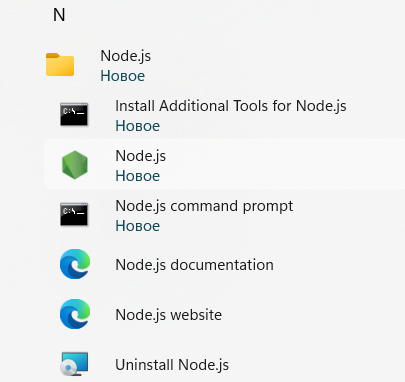
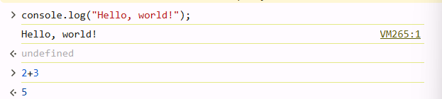
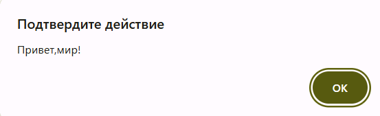
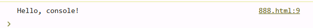
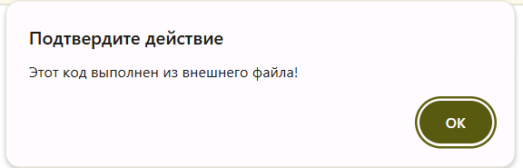
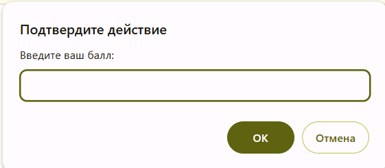
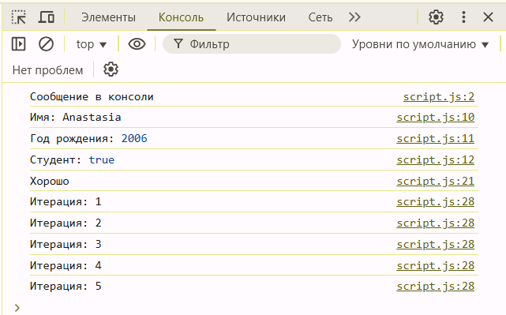

# Лабораторная работа №1
## Задание 1

1. Подготовка среды:
- Установила текстовый редактор VS Code.
- Установила Node.js


2. Выполнение кода JavaScript в браузере

   - Открыла консоль разработчика (`F12` → `Console`).
   - Написала команду `console.log("Hello, world!");` и нажала Enter.
   - Записала в консоли `2 + 3` и посмотрела результат:

    

3. Выполнение кода JavaScript в браузере
    - Создала файл `index.html` и вставила в него следующий код:

   ```html
   <!DOCTYPE html>
   <html lang="en">
      <head>
         <title>Привет, мир!</title>
      </head>
      <body>
         <script>
             alert("Привет, мир!");
            console.log("Hello, console!");
         </script>
      </body>
   </html>
   ```

   - Открыла `index.html` в браузере и посмотрела, как выполняется данный код:

   
     

4. Подключение внешнего JavaScript-файла
    - Создала файл script.js и добавила в него     код:

       ```javascript
       alert("Этот код выполнен из внешнего файла!");
       console.log("Сообщение в консоли");
       ```

    - Подключила файл в `index.html`,    добавила в `<head>`

       ```html
       <script src="script.js"></script>
       ```

    - Открыла страницу в браузере.
       
       

## Задание 2
1. Объявление переменных и работа с типами данных.

   - В файле `script.js` создала несколько переменных:

     - `name` - строка с моим именем.
     - `birthYear` - число, представляющее год моего рождения.
     - `isStudent` - логическая переменная, указывающая, являюсь ли я студентом.

   - Вывела их в консоль.

2. Управление потоком выполнения (условия и циклы)

   - Добавила следующий код в `script.js`:

   ```javascript
   let score = prompt("Введите ваш балл:");
   if (score >= 90) {
     console.log("Отлично!");
   } else if (score >= 70) {
     console.log("Хорошо");
   } else {
     console.log("Можно лучше!");
   }

   for (let i = 1; i <= 5; i++) {
     console.log(`Итерация: ${i}`);
   }
   ```

   - Открыла страницу в браузере и посмотрела, как работают условия и циклы.

    
    
    

## Контрольные вопросы
1. Переменные и их разница:

   - `var` — устаревший способ объявления переменных, область видимости охватывает всю функцию или скрипт. 

   - `let` — переменная, доступная только внутри блока {}, в котором объявлена. 

   - `const` — переменная, которую нельзя изменить после присвоения значения. 

2. `Неявное преобразование` в JavaScript — это автоматическое изменение типа данных при операциях. Если один из операндов `+` — строка, второй тоже превращается в строку: `"5" + 2` → `"52"`. При `-`, `*`, `/` строка, содержащая число, становится числом: `"10" - 4` → `6`, `"6" * "3"` → `18`. Если строку нельзя преобразовать в число, результат — `NaN`, например, `"hello" - 5` → `NaN.`

3. Разница между `==` и `===`
   - Оператор `==` выполняет нестрогое сравнение, при котором значения приводятся к одному типу перед сравнением. 
   - Оператор `===` выполняет строгое сравнение, учитывая как значение, так и тип данных.
   ```javascript
   console.log("2" >= 2);   // true — строка "2" преобразуется в число перед сравнением
   console.log(9 == "9");   // true — строка "9" преобразуется в число 9 перед сравнением
   console.log(9 === "9");  // false — строгий оператор сравнения проверяет и тип данных, и значение
    ```
